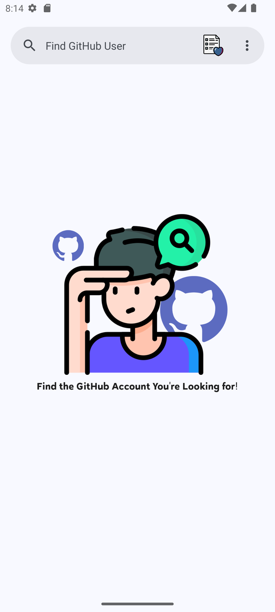
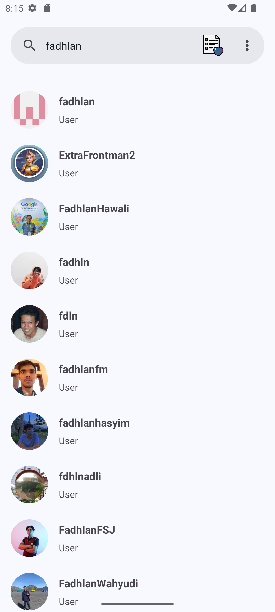
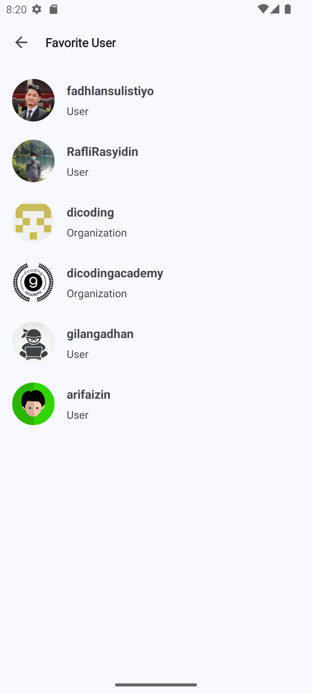
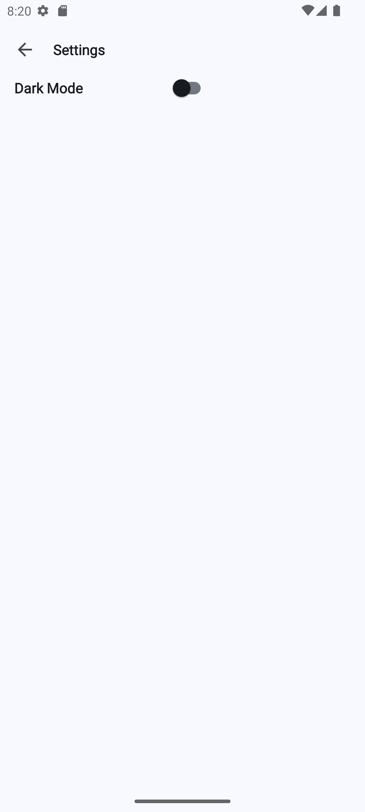

# Find GitHub User

Find GitHub User is an Android application designed to search for GitHub users and view detailed information, including their followers and following lists. Users can also add user details to a favorites list and toggle between light and dark modes. This application was created to update the certificate at the Dicoding Academy, 'Belajar Fundamental Aplikasi Android' as part of the final submission requirement.

## Built With

- [Kotlin](https://kotlinlang.org/)
- [Retrofit](https://square.github.io/retrofit/)
- [Glide](https://bumptech.github.io/glide/)
- [Room](https://developer.android.com/training/data-storage/room)
- [DataStore](https://developer.android.com/topic/libraries/architecture/datastore)
- [LiveData](https://developer.android.com/topic/libraries/architecture/livedata)
- [ViewModel](https://developer.android.com/topic/libraries/architecture/viewmodel)
- [ViewBinding](https://developer.android.com/topic/libraries/view-binding)
- [Coroutine](https://kotlinlang.org/docs/coroutines-overview.html)

## Application Demo

Here are some screenshots demonstrating the application features:

    

## Getting Started

These instructions will get you a copy of the project up and running on your local machine for development and testing purposes.

### Prerequisites

- Android Studio
- A GitHub account (Personal access tokens)

### Installation

1. Clone the repository:
    ```sh
    https://github.com/fadhlansulistiyo/FindGitHubUser.git
    ```
2. Open the project in Android Studio.
3. Set up your GitHub API token:
    - Create a `local.properties` file in the root directory of your project.
    - Add the following line to `local.properties`:
        ```
        API_KEY=token <your api key here>
        ```
4. Build the project in Android Studio.

## Usage

1. Launch the application on an Android device or emulator.
2. Use the search bar to find GitHub users.
3. Click on a user to view their detailed information.
4. Add users to your favorites list.
5. Toggle between light and dark modes in the settings.

## Contributing

1. Fork the repository.
2. Create your feature branch (`git checkout -b feature/AmazingFeature`).
3. Commit your changes (`git commit -m 'Add some AmazingFeature'`).
4. Push to the branch (`git push origin feature/AmazingFeature`).
5. Open a pull request.

## Contact

Fadhlan Sulistiyo Hidayat - [fadhlansulistiyo@gmail.com](mailto:fadhlansulistiyo@gmail.com)
